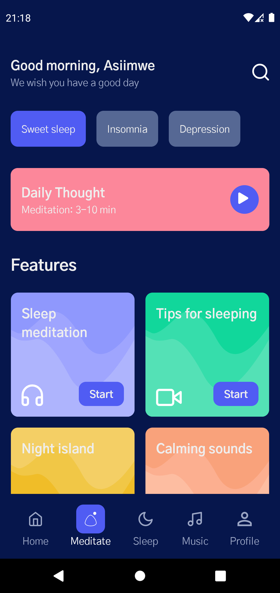

# Recreation of Dribble Android Templates

Recreations of some dribble and popular android app UIs using Jetpack Compose. On going project

This repository contains a set of individual Android Studio projects that I created using Jetpack Compose. These sample projects do not have any functionality implementation. They are just recreations of some designs I find on Dribble.

## 💻 Requirements

To try out these sample apps, you need to use [Android Studio Arctic Fox](https://developer.android.com/studio).

## 🧬 Samples

| Meditation App UI                                                                                                                                                     |                                                                                    |
| :-------------------------------------------------------------------------------------------------------------------------------------------------------------------- | ---------------------------------------------------------------------------------- |
|    Design by [Misha Dupliakin](https://dribbble.com/mishadupliakin)   **[> Check out the code](https://github.com/asiimwedismas/meditation-app-ui)**   |  |
|                                                                                                                                                                       |                                                                                    |
